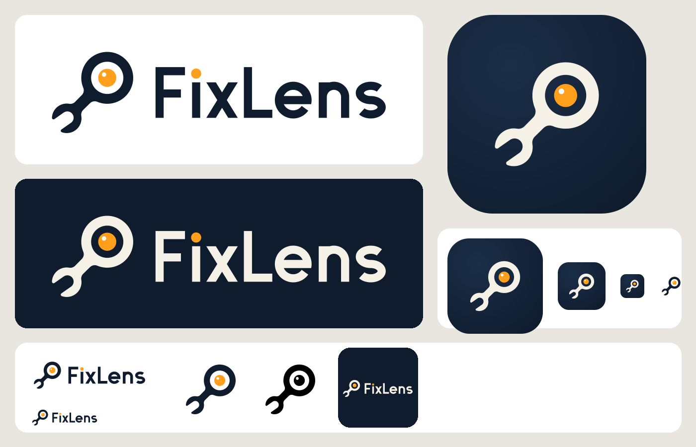

# FixLens logo

## Concept: the lens-wrench

The mark is a combination wrench. Its ring end is the camera lens, and the lens holds
**Fixy's eye**: an amber iris with a single catchlight.

- **Wrench.** The open-end jaw (bottom left) makes it read as a repair tool straight away,
  not as a magnifying glass.
- **Lens.** The ring end is the camera, the part of FixLens that sees what you see.
- **Marker.** The amber iris sits dead centre in the lens. It is the same amber as the AR
  marker in the app: "this exact part".
- **Fixy.** The catchlight makes the lens look like a bright, attentive eye. That gives the
  mark a friendly personality without turning it into a robot or an emoji. The rounded jaw
  tips and smooth fillets keep it calm and approachable.
- **Direction.** The wrench points up and to the right, which reads as forward and upbeat.
  The diagonal also fits circular and squircle launcher masks well.

The wordmark is custom geometric sans lettering, drawn as outlines (no font needed). It
uses a monoline weight that matches the ring of the mark. The dot on the **i** is the same
amber marker, so it ties the name to the mark.

### Explorations (`concepts/`)
| File | Idea | Verdict |
|---|---|---|
| `concept-1.svg` | Talking lens: a speech bubble with a lens inside (voice + camera) | Friendly, but reads as a chat app or an eyeball. It says nothing about repair. |
| `concept-2.svg` | Wrench lens: the ring end of a wrench as the lens, with an amber marker | **Chosen.** It is the only concept that says *repair* and *camera* at a glance, and it is the most ownable. |
| `concept-3.svg` | Lock-on lens: AR corner brackets around a smiling lens | Clear AR idea, but too close to Google Lens (frame + circle + dot), and the smile tips it into emoji territory. |

## Palette

| Name | Hex | Use |
|---|---|---|
| Ink | `#0F1C2E` | Primary: mark and wordmark on light backgrounds, icon background |
| Signal Amber | `#FF9F1C` | Accent: Fixy's eye/marker and the i-dot only. It matches the in-app AR marker. |
| Paper | `#F6F1E7` | Mark and wordmark on dark backgrounds (warm white) |

The catchlight is pure white (`#FFFFFF`). The icon background uses a subtle radial glow
from `#1B2E48` to Ink.

Contrast: Ink on white is about 17:1, Paper on Ink about 15:1, and Amber on Ink about 8.4:1.
Amber on white is only about 2:1, so **never set text in amber on light backgrounds**.
Amber is reserved for the dot accents.

## Files

| File | Use |
|---|---|
| `fixlens-logo.svg` | Primary horizontal lockup, for light backgrounds (transparent) |
| `fixlens-logo-dark.svg` | The same lockup in Paper, for dark backgrounds (transparent) |
| `fixlens-mark.svg` | The mark on its own, 512×512, transparent |
| `fixlens-mark-mono.svg` | Single-colour mark using `currentColor` (favicons, notification icons, stamps, print) |
| `fixlens-app-icon.svg` | Launcher/Play-style icon, 512×512: Paper mark on an Ink squircle. The mark sits inside the central 66% circle (its furthest point is 166 px from the centre, and the safe radius is 169 px), so it survives circle, squircle and rounded-square masks. |
| `concepts/*.svg` | The three explorations |
| `preview.png` | Overview sheet: lockups on light and dark, the app icon, and small sizes |

For an Android adaptive icon, use the icon's background (Ink, or the glow) as the background
layer. Use the mark group (Paper wrench + amber eye) as the foreground layer. The glass of
the lens is a real hole, so the background shows through it.

## Usage

- **Clear space:** keep a margin around the lockup or the mark of at least **one lens
  diameter** (the hole in the ring end) on every side. The SVG files include only a small
  built-in margin.
- **Minimum size:**
  - Lockup: 120 px wide on screen, or 30 mm in print.
  - Colour mark: 24 px.
  - Below 24 px, use `fixlens-mark-mono.svg`, because the catchlight disappears. The mark
    stays recognisable down to 16 px.
  - The app icon is checked at 48 px and 96 px.
- **Don't:** recolour the eye (it is always amber in colour versions), rotate the mark to
  horizontal, add outlines or shadows, stretch it, or set the wordmark in a live font.
